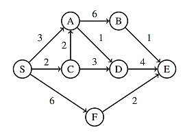

Este é um modelo de **README.md** estruturado para a sua atividade. Ele explica a teoria por trás do algoritmo, como ele foi aplicado ao seu grafo específico e o que cada parte do código Python faz.

-----

# Resolução: Algoritmo de Dijkstra

Este repositório contém a resolução da atividade prática sobre o **Algoritmo de Dijkstra**, um algoritmo guloso (greedy) utilizado para encontrar os caminhos mais curtos entre um nó de origem e todos os outros nós em um grafo com pesos de aresta não negativos.

## 📌 O Problema

O objetivo é determinar a **Árvore de Caminhos Mínimos** partindo do nó origem **S** para os demais nós (A, B, C, D, E, F) com base no seguinte grafo:



---

## 🧠 Funcionamento do Algoritmo

O funcionamento do Dijkstra baseia-se em três conceitos principais:

1.  **Estimativa de Distância:** Inicialmente, atribuímos distância $0$ à origem e $\infty$ (infinito) aos demais nós.
2.  **Seleção Gulosa (Fila de Prioridade):** O algoritmo sempre escolhe o nó com a menor distância acumulada que ainda não foi "fechado" (visitado).
3.  **Relaxamento de Arestas:** Ao visitar um nó, verificamos se o caminho através dele para seus vizinhos é menor do que o caminho conhecido anteriormente. Se for, atualizamos a distância e o predecessor.

-----

## 💻 Implementação em Python

A solução foi implementada utilizando a biblioteca `heapq`, que fornece uma fila de prioridade eficiente (Min-Heap), garantindo que o nó de menor custo seja sempre processado primeiro ($O(E \log V)$).

### Componentes do Código:

  * **Dicionário de Adjacências:** O grafo é representado como um mapa onde cada chave é um nó e o valor é outro dicionário contendo seus vizinhos e os pesos das arestas.
  * **Dicionário de Distâncias:** Armazena o menor custo encontrado até o momento para cada nó.
  * **Dicionário de Predecessores:** Fundamental para reconstruir o caminho. Ele "lembra" de onde viemos para chegar a um nó pelo menor custo.
  * **Loop de Relaxamento:**
    ```python
    if distancia_atual + peso_aresta < distancias[vizinho]:
        distancias[vizinho] = nova_distancia
        predecessores[vizinho] = no_atual
    ```
    Este trecho é o coração do algoritmo, onde as rotas são otimizadas.

-----

## 📊 Resultado da Execução

Após o processamento do grafo apresentado na imagem, obtivemos os seguintes resultados partindo de **S**:

| Nó Destino | Menor Custo | Predecessor | Caminho (Rastro) |
| :--- | :---: | :---: | :--- |
| **S (Origem)** | 0 | - | S |
| **C** | 2 | S | S → C |
| **A** | 3 | S | S → A |
| **D** | 4 | A | S → A → D |
| **F** | 6 | S | S → F |
| **E** | 8 | D | S → A → D → E |
| **B** | 9 | A | S → A → B |

### Análise de Pontos Chave:

  * **Convergência para D:** Embora houvesse um caminho via C ($C \rightarrow D$), o caminho via A ($A \rightarrow D$) resultou em um custo total menor ($3+1=4$ contra $2+3=5$), demonstrando o relaxamento em ação.
  * **Empate no Nó E:** O nó E poderia ser alcançado com custo 8 tanto por **D** ($4+4$) quanto por **F** ($6+2$). O algoritmo selecionou o primeiro caminho de custo 8 encontrado na fila de prioridade.

-----

## 🛠️ Como Executar

1.  Certifique-se de ter o **Python 3.x** instalado.
2.  Salve o código da solução em um arquivo chamado `dijkstra.py`.
3.  Execute o comando:
    ```bash
    python dijkstra.py
    ```